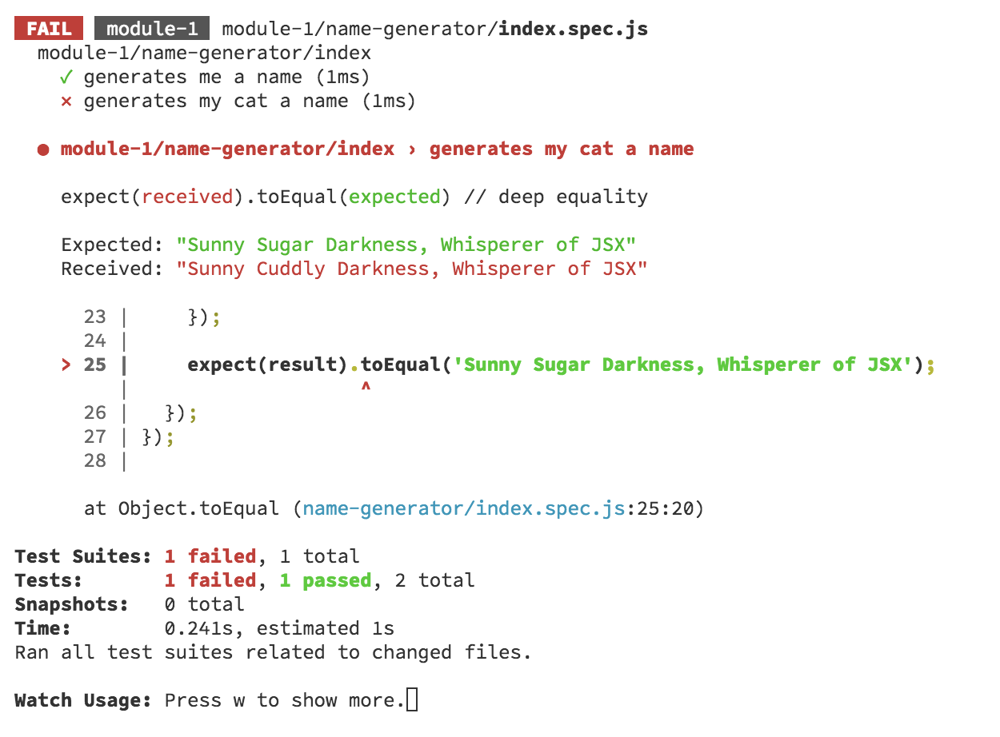

# Module 1: Jest

## Background

This module allows you to explore the Jest watch-mode. It will help you get comfortable running tests in this workshop.

The code under test is a "✨JavaScript Unicorn 🦄 Name Generator ✨". The rules for generating names can be seen in [the table at the end of this README](#appendix-generation-rules).

## Start up the tests

👉 Open a new command window from the root of this project. Enter `npm run test-module-1`. This will start up the test suite.

When the test suite starts running, it will give you a message that reads

`No tests found related to files changed since last commit.`

This is because you haven't made any local changes. By default, Jest only runs tests for files that have been affected by your local changes. This is really helpful for Test-Driven Development - it allows you to focus on the code you're currently writing.

## Running all tests

Jest also offers the ability to run all tests in your test suite. Let's do that now!

👉 In the Jest watch window, hit `a` to run all test suites.

This will run all tests in the test suite. You should see a bunch of tests run! (And succeed!)

At any time, you can change the tests being run by hitting the `w` key to return to a watch menu, and selecting the tests you want to run.

Jest offers you several options by which to filter your tests:

- `a`: Run all tests.
- `f`: Run only tests that failed in their last run. This is useful when you break stuff, and want to focus on just the tests that you need to fix.
- `p`: Run tests filtered by a filename regex pattern. This can be useful if you want to run all tests in a specific folder.
- `t`: Run tests filtered by a test name regex pattern. This is useful when you want to run all tests related to a specific feature.
- `o`: Run only tests that are affected by local changes since your last commit. This is the default when you start up Jest.

> **Note**: Test filters are generally combined. If you type `f` to filter by failing tests, and then `p` to filter by a filename, you will filter by both. Jest will always tell you how to clear out any existing filters, but be warned that the key to clear filters sometimes varies. Sometimes it's `c` to clear existing filters, sometimes it's the same key you pressed to get into your current filter, sometimes you just have to hit `o` to get back to running only tests affected by local changes.

## Let's try a few filters out!

### Running tests filtered by filename

👉 In the Jest watch window, hit `w`, then `p`.

👉 Enter `birth` to filter by filenames containing `birth`.

You should see tests run for `birth-date-translator.js` and `birth-month-translator.js`. All of them should be passing.

### Running tests filtered by test name

👉 In the Jest watch window, hit `w`, then `c`, to clear the existing search filter.

👉 In the Jest watch window, hit `w`, then `t`.

👉 Enter `cat` to filter by test names containing `cat`.

You should see 2 tests run. All of them contain the word `cat` (though Jest doesn't make that very clear).

### Running only tests affected by your latest changes.

Let's go back to the default - running only tests affected by your latest changes.

👉 In the Jest watch window, hit `w`, then `o`.

You'll see the message again that "no tests were found related to your latest changes."

## Let's break stuff!

Jest gives helpful feedback when a test fails. Let's break a test, to see what it looks like.

👉 Open the file `module-1/name-generator/index.spec.js`.

In the test named `generates my cat a name`, the `generateName()` function is called with several arguments. It looks like this:

```javascript
const result = generateName({
  firstName: 'Bartleby',
  middleName: 'Burtleby',
  lastName: 'Turtle',
  birthMonth: 'April',
  birthDate: 8,
});
```

👉 Change some of the arguments in this call, and save the file.

You should see an error message in your test watch window.

> **Note**: If you changed some arguments but the test didn't break, you might have used a name with the same initial as the original. Due to the very "complicated" logic of the name generator, this would cause the test to continue passing. 😬

My test failure looks like this:



From this output, you should be able to identify the following:

- The file containing the test that failed.
- The name of the test that failed
- The expected value for the failed assertion
- The actual value for the failed assertion
- The line of code where the test failed

Make sure you can identify each of these before proceeding.

👉 Revert your changes.

We want to make sure we have passing tests before moving on. You can revert your changes manually, or through git.

## Let's make some changes!

Take a look at the [name generation table](#appendix-generation-rules) at the end of this doc. The code is implemented for these rules, but it lacks tests!

👉 Add tests for translation of your first name, middle name, last name, birth month, and birth date according to these rules.

You'll find existing tests for all of these translations in the `module-1/name-generator` folder:

- `first-name-translator.spec.js`
- `middle-name-translator.spec.js`
- `last-name-translator.spec.js`
- `birth-month-translator.spec.js`
- `birth-date-translator.spec.js`

If you get stuck on these tests, look at the existing tests to see if they're different.

👉 Add an "integration" test for the combination of your first name, middle name, last name, birth month, and birth date according to these rules.

You'll find existing "integration" tests in the `module-1/name-generator/index.spec.js` file.

If you get stuck on this test, look at the existing tests to see if they're different.

👉 If you complete these tasks early, write more tests!

## Suggestions

- If you get stuck on a test, use `console.log` to output values to help you identify the problem. You can use `console.log` from your test code, or from the function being tested, and it will show up in your Jest output.

## Appendix: Generation Rules

This table lists the rules for generating a JavaScript unicorn name.

| First Initial     | Middle Initial   | Last Initial       | Birth Month           | Birth Date                         |
| ----------------- | ---------------- | ------------------ | --------------------- | ---------------------------------- |
| **A**: Emerald    | **A**: Royal     | **A**: Hooves      | **Jan**: Tamer of     | **1**: Associative Arrays          |
| **B**: Sunny      | **B**: Sugar     | **B**: Bubbles     | **Feb**: Wielder of   | **2**: JavaScript Fatigue          |
| **C**: Snowy      | **C**: Magic     | **C**: Dream       | **Mar**: Breath of    | **3**: Yak Shaving                 |
| **D**: Whispering | **D**: Sparkle   | **D**: Jewels      | **Apr**: Whisperer of | **4**: No Semicolons               |
| **E**: Elegant    | **E**: Spotted   | **E**: Twirly-Tail | **May**: Face of      | **5**: Webpack                     |
| **F**: Silly      | **F**: Happy     | **F**: Starshine   | **Jun**: Conjurer of  | **6**: Bananas in Boxes            |
| **G**: Fluffy     | **G**: Golden    | **G**: Toes        | **Jul**: Harvester of | **7**: Linting rules               |
| **H**: Ruby       | **H**: Princess  | **H**: Briar       | **Aug**: Heart of     | **8**: JSX                         |
| **I**: Tiny       | **I**: Serene    | **I**: Socks       | **Sep**: Healer of    | **9**: Object.assign               |
| **J**: Rising     | **J**: Crystal   | **J**: Glimmer     | **Oct**: Seeker of    | **10**: filter/map/reduce          |
| **K**: Perky      | **K**: Silver    | **K**: Kisses      | **Nov**: Avenger of   | **11**: Bikeshedding               |
| **L**: Dancing    | **L**: Lovely    | **L**: Sunrise     | **Dec**: Harbinger of | **12**: Angular                    |
| **M**: Whirling   | **M**: Prince    | **M**: Wings       |                       | **13**: React                      |
| **N**: Shiny      | **N**: Peaceful  | **N**: Starfire    |                       | **14**: Immutability               |
| **O**: Enchanted  | **O**: Rainbow   | **O**: Sunset      |                       | **15**: Functional programming     |
| **P**: Merry      | **P**: Regal     | **P**: Comet       |                       | **16**: .babelrc                   |
| **Q**: Shimmering | **Q**: Starry    | **Q**: Heart       |                       | **17**: Promises                   |
| **R**: Cloudy     | **R**: Flowing   | **R**: Dandelions  |                       | **18**: Closures                   |
| **S**: Sassy      | **S**: Cuddly    | **S**: Moonbeam    |                       | **19**: The virtual DOM            |
| **T**: Soaring    | **T**: Forever   | **T**: Darkness    |                       | **20**: Electron                   |
| **U**: Fuzzy      | **U**: Glitter   | **U**: Thunder     |                       | **21**: Type-safety                |
| **V**: Fancy      | **V**: Cascading | **V**: Starlight   |                       | **22**: Variable hoisting          |
| **W**: Bedazzled  | **W**: Tender    | **W**: Brambles    |                       | **23**: The event loop             |
| **X**: Prancing   | **X**: Sweet     | **X**: Twinkle     |                       | **24**: npm                        |
| **Y**: Piercing   | **Y**: Feisty    | **Y**: Fairy       |                       | **25**: CSS-in-JS                  |
| **Z**: Dashing    | **Z**: Spirit    | **Z**: Miracle     |                       | **26**: IIFEs                      |
|                   |                  |                    |                       | **27**: Pure functions             |
|                   |                  |                    |                       | **28**: TypeScript                 |
|                   |                  |                    |                       | **29**: Cross-site Request Forgery |
|                   |                  |                    |                       | **30**: Memoization                |
|                   |                  |                    |                       | **31**: Vue                        |
