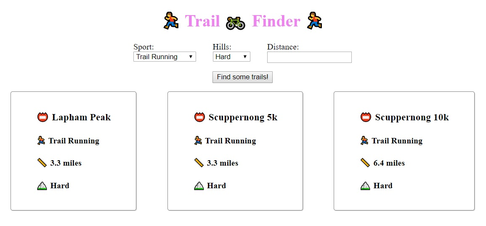

# Module 4 - Real-life TDD

Module 4 gives you experience with applying TDD to real-life problems. It is broken into three submodules: [4a. Mocking Dependencies](#module-4a-mocking-dependencies), [4b. Business Logic](#module-4b-business-logic), and [4c. Fixing Bugs](../module-4c/README.md#module-4c-fixing-bugs).

## Module 4a: Mocking Dependencies

Real-life problems aren't always easy to test. This submodule will teach you how to isolate things you don't control, or aren't sure how to test.

### Background

The app we're testing in this module is a "trail finder". We have a search form with which the user can filter the results, and a button that retrieves trails based on the filters.

The web app (located in the folder `module-4ab/app`) makes calls to an API(`module-4ab/api`). The API returns results filtered from a hardcoded data-set (`module-4ab/api/trail-data.js`).

Trails have a name, sport, hill difficulty, and distance associated with them. Users will be able to filter by sport, hill difficulty, and distance.

### Start up the app

&#128073; Open a command window from the root of this project, and run `npm run serve-module-4ab`. This should open a browser window at localhost:8080. You should see a search form with three fields.

&#128073; Click the 'Find some trails!' button. You should see results!

&#128073; Select a sport from the 'Sport' dropdown. Click the 'Find some trails!' button. You should see fewer results!

### Start up the tests

&#128073; From another command window at the root of this project, run `npm run test-module-4ab`. This will start up the test suite for this module.

At this point, no tests should run, and you should see this message:

`No tests found related to files changed since last commit.`

### Mocking Concepts

If you're unfamiliar with the concept or practice of mocking, or if you want to read about how this example is already using mocking, [please read this guide](MOCKING.md).

If you're already familiar with mocking, you don't need to read the guide.

### Features

There are a couple scenarios we want to account for in our search-form.

#### When the API returns no results, we should show a message that says "No results found."

&#128073; In the app, select "Cycling" and "Medium" from the Sport and Hills dropdowns. Click the 'Find some trails!' button.

Notice that there are no results on the page, but also no indication that it didn't return results. We'll want to add a message indicating that no results were found.

&#128073; Implement a feature, using TDD, such that an empty search shows a message that reads "No results found".

**Hint**: You'll implement this logic in the `module-4ab/app/search-form/render-successful-output.js` file.

**Hint**: You'll write your tests in the `module-4ab/app/search-form/render-successful-output.spec.js` file. The existing test named `it('renders a list if there are results')` is a good example to look at.

**Hint**: Everything you need to implement this feature can already be found in the renderSuccessfulOutput function & tests.

If you get stuck on this feature, see [`./__solutions/app/search-form/render-successful-output.js`](./__solutions/app/search-form/render-successful-output.js) and [`./__solutions/app/search-form/render-successful-output.spec.js`](./__solutions/app/search-form/render-successful-output.spec.js) for a possible solution.

#### When the API throws an error, we should show a message that says "Something went wrong."

We can't recreate this in the app at the moment, but we've been told that the API sometimes returns an error. We should probably account for this possibility, and add a message that indicates when something went wrong.

We've already stubbed this function out - our orchestration tests verified that when an error occurred, we would call a function named `renderErroneousOutput`, imported from `render-erroneous-output.js`.

This function doesn't actually do what we need it to do, though.

&#128073; Implement a feature, using TDD, such that when the API throws an error, the user sees a message that says "Something went wrong.".

**Hint**: You'll implement this logic in the `module-4ab/app/search-form/render-erroneous-output.js` file.

**Hint**: You'll write your tests in the `module-4ab/app/search-form/render-erroneous-output.spec.js` file.

**Hint**: Everything you need to implement this feature can be found in the renderErroneousOutput function & tests.

If you get stuck on this feature, see [`./__solutions/app/search-form/render-erroneous-output.js`](./__solutions/app/search-form/render-erroneous-output.js) and [`./__solutions/app/search-form/render-erroneous-output.spec.js`](./__solutions/app/search-form/render-erroneous-output.spec.js) for a possible solution.

## Module 4b: Business Logic

One great place to introduce TDD into your app is business logic. Business logic is generally not related to UI, so it is usually easier to test. It can also be easily isolated to small functions, which makes it easier to write, read, and maintain tests.

### Background

We're reusing our "trail finder" app for this submodule.

### Business Problem

Our app UI has the ability to filter by distance, but our API isn't actually doing anything with that field yet. You'll need to implement this!

### Start up the app

If you stopped running the app after the [Mocking Dependencies submodule](#mocking-dependencies), re-start it.

&#128073; Open a command window from the root of this project, and run `npm run serve-module-4ab`. This should open a browser window at localhost:8080. You should see a familiar search form.

### Start up the tests

If you stopped the tests after the [Mocking Dependencies submodule](#mocking-dependencies), re-start them.

&#128073; From another command window at the root of this project, run `npm run test-module-4ab`. This will start up the test suite for this module.

### Experience the missing feature

&#128073; In the app, enter a distance of '5'. Click the 'Find some trails!' button.

You would expect the results to be filtered by distance, but they aren't. This is because we haven't implemented this feature yet.

### Implement the missing feature

&#128073; Implement a feature to support the `distance` parameter being passed into our trails API controller.

We get a query parameter passed into the api for handling distances. It's named 'distance', and it contains a number that reflects the approximate number of miles we want to search for.

Depending on the value, the range of results will vary.

- If the distance is less than 10, it should return trails within a mile of the value passed in. For example, if the value passed in is 3, it should return results from 2 to 4 miles long.
- If the distance is more than 10 but less than 20, it should return trails within 2 miles of the value passed in. For example, if the value passed in is 15, we should see results from 13 to 17 miles long.
- If the distance is more than 20, it should return trails within 3 miles of the value passed in. For example, if the value passed in is 24, we should see results from 21 - 27 miles long.

**Hint**: You'll implement this feature in the `/module-4ab/api/trails/controller.js` file.

**Hint**: You'll implement tests for this feature in the `/module-4ab/api/trails/controller.spec.js` file.

**Hint**: The existing features that filter by sport or hills are a good example to look at for this work.

**Hint**: Once you've written tests and implemented this, you can verify the behavior in the app by entering a distance and filtering.

If you get stuck on this feature, see [`./__solutions/api/trails/controller.js`](./__solutions/api/trails/controller.js) and [`./__solutions/api/trails/controller.spec.js`](./__solutions/api/trails/controller.spec.js) for a possible solution.
