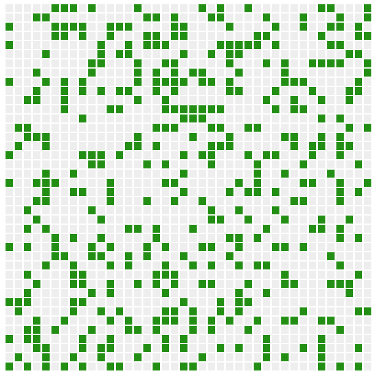

# Module 5: Solving Problems Together - Conway's Game Of Life

This module presents a more complicated problem to give you more TDD experience. We'll work through it in pairs.

## Background

Conway's Game Of Life is a cellular automaton devised by the British mathematician John Horton Conway in 1970. [(Wikipedia)](https://en.wikipedia.org/wiki/Conway%27s_Game_of_Life)

The Game Of Life is based on a large grid of cells, each of which has an "on" or "off" state. "Life" advances one tick at a time, and cells die, survive, or regenerate based on a simple set of rules.

For this module, the game board has been built for you. You will implement the rules that determine which cells die, which cells survive, and which cells regenerate, using TDD.

## Pair Up!

Remember when I said this workshop is collaborative? I meant it!

👉 Pair up with the person sitting next to you. You're going to work together for this module.

👉 Choose one computer to work from. I recommend determining which of you is more comfortable using the other's text editor, and choosing that computer.

## Start Up The Game

👉 Open a new command window from the root of this project, and type `npm run serve-module-5`. This should open a browser window at localhost:8080. The screen will look like this:


This is a randomized starting state for the Game Of Life. We're using a 40x40 grid in this implementation.

Every cell in the grid can be in one of two states: alive or dead. The alive cells show as green, the dead cells are gray.

The game advances one tick at a time. Each tick takes about half a second. For every tick, each cell will determine its next state based on its 8 neighbors.

👉 Hit the "Start" button. You should see the green cells dance around, as "life" advances. Currently, the cells are configured to **randomly** replace the previous state. You'll use TDD to remove the randomness!

👉 Hit the "Stop" button. The green cells should stop dancing. You may have to click more than once to make them stop 😬.

There's no actual reason you need to stop the game - the "Stop" button is there in case you get sick of watching the cells dance.

## Get Your Bearings

👉 Take a look at the `module-5/get-next-state.spec.js` test file. This is where you'll be writing your tests for this exercise.

Currently you'll see two tests. One verifies that an exception is thrown if no grid is passed; the other verifies that the grid returned is the same size as the grid passed.

A "grid" is represented as an array of arrays. Each child array is a "row" in the grid; each item in a child array is a "cell" in the grid.

For example, this is a representation of a 3x3 grid, where only the middle cell is active:

```
[
  [0,0,0], // Row 1
  [0,1,0], // Row 2
  [0,0,0], // Row 3
]
```

Note that this example also shows all 8 neighbors of the middle cell (they all have a value of 0).

👉 Take a look at the `module-5/get-next-state.js` file. This is where you'll be implementing the specifications for this exercise.

Currently you'll see code that verifies the `currentState` is not null, and generates an appropriately sized grid of randomized cells. This is why, when you clicked "Start" in the app, you saw the cells shifting randomly.

When the app is running, it will repeatedly pass the current 40x40 state to `getNextState`, and render the state returned. By the end of the exercise, you'll have updated `getNextState` so that it returns the correct next state.

👉 Start up the test suite.

From a command line at the root of this workshop project, type `npm run test-module-5`. This will start up the test suite.

At this point, no tests should run, and you should see this message:

`No tests found related to files changed since last commit.`

## Let's Write Some Tests!

### The Ground Rules

#### 1. Don't write new code without writing a test first

#### 2. Take turns

You'll be taking turns writing tests and making them pass, and working together to refactor along the way.

#### 3. Collaborate to define the test cases

#### 4. When you are typing, you decide the code that is written

You may ask for the other’s opinion, but the other may not force you to write the code a certain way.

### The Workflow

Your collaboration workflow will look like this:

- Person 1: Write a failing test
- Person 2: Make the test pass
- Person 1&2: Refactor together
- Person 2: Write a failing test
- Person 1: Make the test pass
- Person 1&2: Refactor together
- Repeat

### Write Your First Test

The full list of specifications is listed [at the end of the README](#appendix-full-specifications). Let's walk through the first specs together.

The first specification reads:

> #### 0. Begin with a random "seed" or starting sequence. For each "tick" of the game, return the next state based on the current state.

This spec is already done for you. ✅

The next spec reads:

> ### For a space that is 'alive' (i.e. has a value of 1 in our implementation):
>
> #### 1. Each cell with one or no neighbors dies (becomes a 0), as if by solitude.

I see a handful of problems involved in accomplishing this spec:

- We need to base a current cell's state on the state of its neighbors.
- Each cell can have up to 8 neighbors, so we have to look at all 8 of them.
- Corner or edge cells have less than 8 neighbors, so we have to make sure we don't "overflow".
- We need to count how many of a cell's neighbors are alive.

That's a lot of tests we will need to write. Let's start with the first problem: "we need to base a current cell's state on the state of its neighbors."

In fact, we can break that down even smaller: let's start with a test to base a current cell's state on the state of only its **left** neighbor. This is not going to produce the final shipped result, but it will get us one step closer.

👉 Write a test in `get-next-state.spec.js` that passes a 3x3 grid and verifies that tiles in the grid become alive only if their leftmost neighbor is alive.

You can see an example of this test in [`./__solutions/get-next-state.spec.js`](./__solutions/get-next-state.spec.js). (Note that it is commented out in that file.)

## Your Assignment

There's a lot more to implement. One next step might be to write a test that verifies that each cell depends on its left **or right** neighbor. You could iteratively build up to cover all neighbors, then count the number of alive neighbors.

Finish implementing this spec, and all other remaining specs!

This problem is hard. I don't expect you to finish. Even the first spec is difficult. Here are some suggestions that might help you along the way:

## Suggestions

### Keep all methods below 5 lines

Extract functions to make your code smaller & easier to understand.

### Do one task at a time

Try not to implement more than one spec at a time!

### Don't forget - each cell has up to 8 neighbors, not 4.

Diagonals count! Below you can see a green cell with all 8 of its neighbors in gray:


### Start by writing specs that aren't going to ship.

Instead of only surviving if it has N neighbors, have a cell survive only if it has a living neighbor to the left...

Then if it has a living neighbor to the right...

Then above, then below...

Then if it has more than one living neighbor...

None of these specifications are in the final solution, but they will help you build incremental code. This will help prevent you having to make a leap to the final working solution, and point you in the right direction.

Eventually, though, you'll want to delete those incremental tests.

### Delete tests that are no longer helpful

Often we use tests to guide us to a state that is closer to our final state, but not yet complete. You'll find a point where some tests no longer serve you. Don't be afraid to remove them, or to rewrite them to be helpful!

### Make specific assertions

General assertions are likely to be invalidated by future tests.

For example, comparing the result of a test to an entire grid is likely to become obsolete when we introduce later specs.

Instead, write assertions that validate only the cells that prove your test, like the following.

```
it('dies if it is alive and has less than two neighbors', () => {
  const input = [
    [1,0,0],
    [0,1,0],
    [0,0,0]
  ];

  const result = getNextState(input);

  // This asserts against a specific cell, instead of the entire result grid.
  expect(result[1][1]).toEqual(0);
})
```

### Refactor to make space for a new feature before you write its test

Sometimes the current state of our code isn't ready for us to introduce a new spec. A new spec might be more easily introduced if we first make some changes to our code. When you notice this, refactor your code before writing the next failing test. This allows you to remain in green for longer, instead of fighting your refactor while in a state of red.

### If you support "the blinker", you're probably feature-complete.

"The blinker" is an oscillating pattern. Its makeup is such that it keeps itself "alive," and perpetually in motion. It looks like this:


A good test for this oscillator would take input

```
[
  [0,1,0],
  [0,1,0],
  [0,1,0]
]
```

and verify the return value is

```
[
  [0,0,0],
  [1,1,1],
  [0,0,0]
]
```

If your system supports the blinker, you've probably got all of your features implemented properly.

## When are you complete?

When the cells start to cluster and make organic "living" shapes, like this:



## Appendix: Full Specifications

#### 0. Begin with a random "seed" or starting sequence. For each "tick" of the game, return the next state based on the current state.

### For a space that is 'alive' (i.e. has a value of 1 in our implementation):

#### 1. Each cell with one or no neighbors dies (becomes a 0), as if by solitude.

#### 2. Each cell with four or more neighbors dies (becomes a 0), as if by overpopulation.

#### 3. Each cell with two or three neighbors survives (remains a 1).

### For a space that is 'dead' or 'empty' (i.e. has a value of 0):

#### 4. Each cell with three neighbors becomes 'alive' (becomes a 1).
